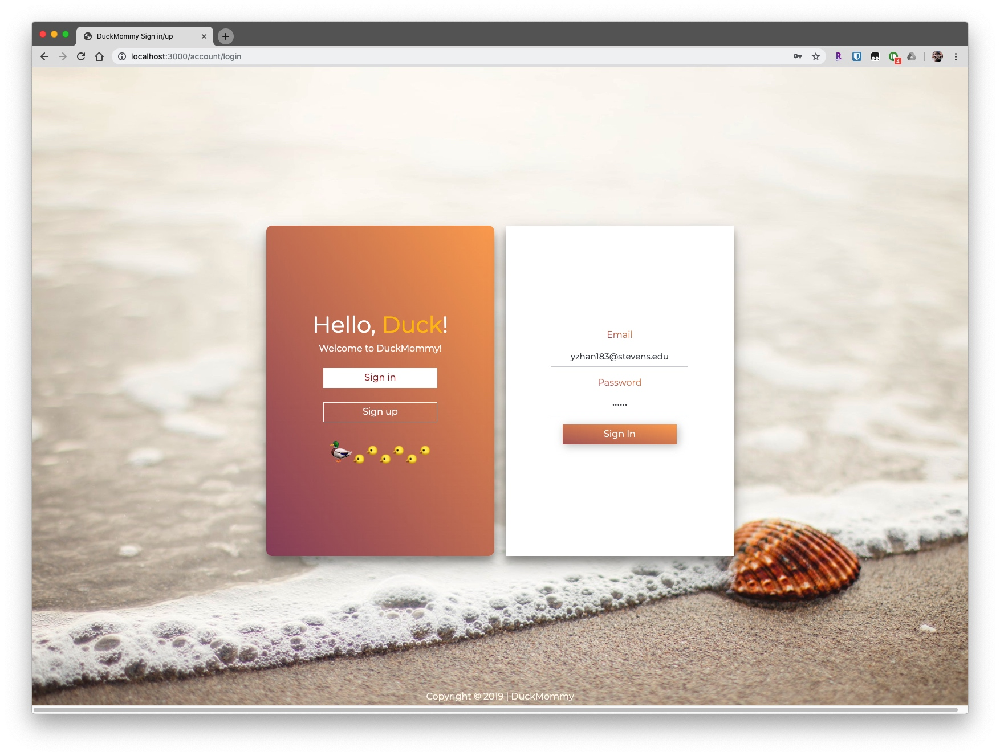
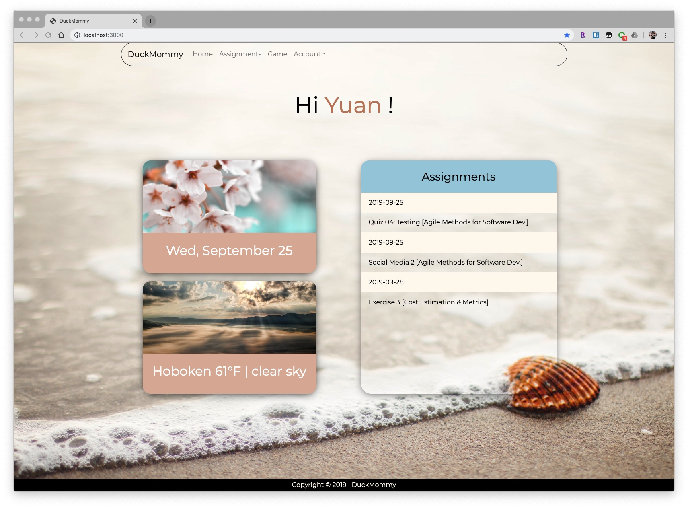
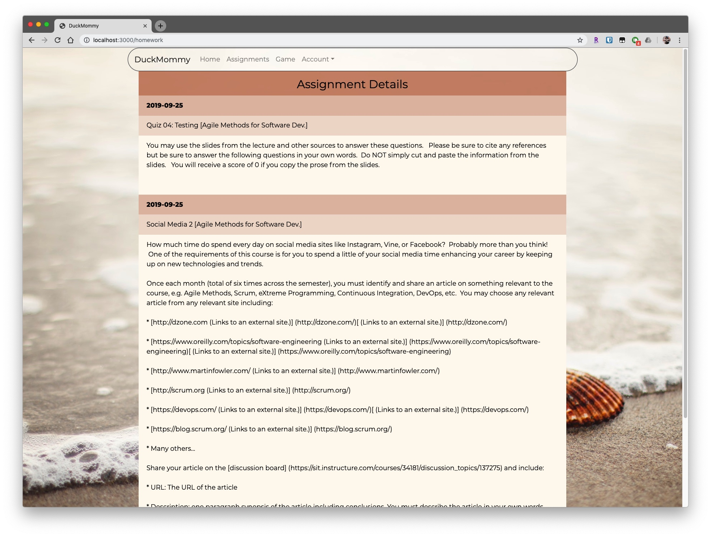
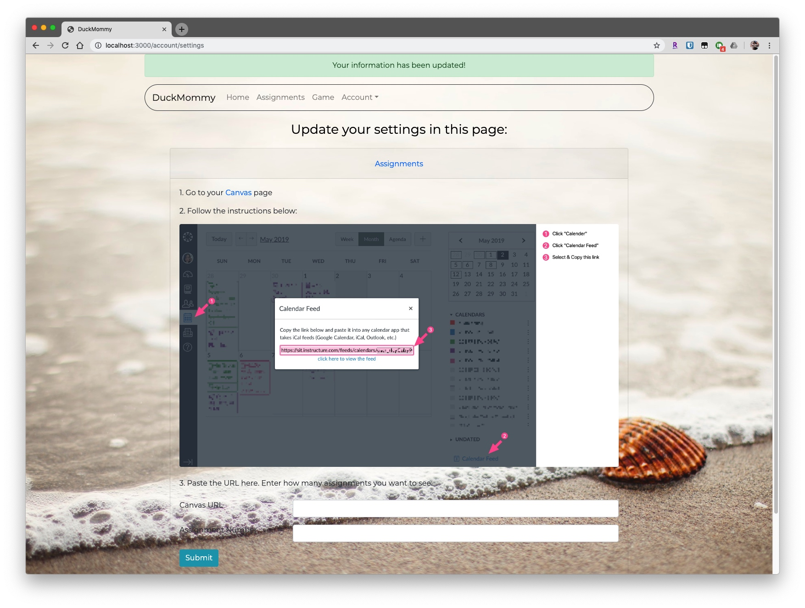

# DuckMommy Student Information Website
## Overview
This is a responsive website developed by our team from scratch, allowing users to:
- check current location & weather
- check courses & upcoming assignments
- create account, receive notification email, login & logout
- Customize the page by updating settings

## Technology Stack
Front end: HTML, CSS, Pug, Bootstrap, JavaScript
Back end: Nods.JS, Express
Database: MongoDB 
 
## What It Looks Like

